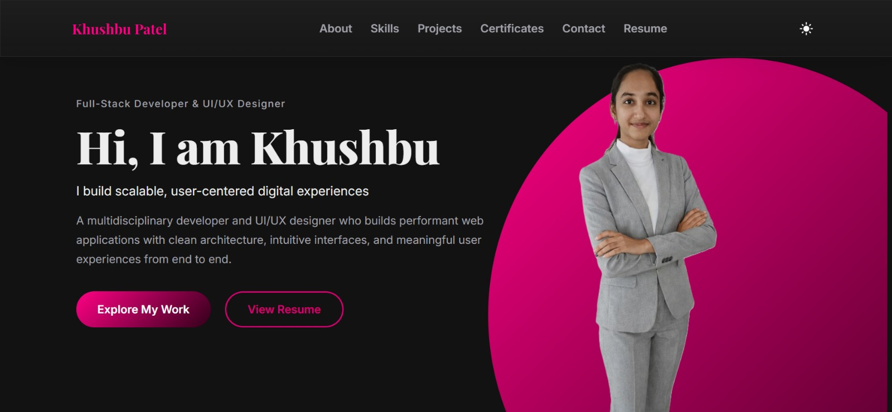

# 🚀 Khushbu Patel – Personal Portfolio

A modern, animated portfolio website built with React (Vite) to showcase my projects, technical skills, certifications, and contact information.

This portfolio reflects my approach to development — combining clean architecture, smooth user experience, and thoughtful design.

---

🔗 Live Website:
https://khushbu-patel-portfolio.netlify.app/

---

## ✨ Highlights

⚡ Built with React (Vite) for fast performance

🎬 Smooth animations powered by GSAP

🎨 Custom 3D animated logo intro

📱 Fully responsive across devices

🛠️ Interactive project filtering system

🪟 Modal-based certificate viewer

📩 Functional contact form using EmailJS

🌙 Clean dark-themed and light-themed modern UI

---

## 🛠️ Tech Stack

Frontend

- React (Vite)

- JavaScript (ES6+)

- CSS3 (Custom Styling)

Animations

- GSAP (GreenSock Animation Platform)

- Scroll-triggered transitions

Services

- EmailJS (Contact Form)

- Netlify (Deployment & Hosting)

---

## 📸 Preview

You can view the live version here:
👉 https://khushbu-patel-portfolio.netlify.app/



---

## 📁 Project Structure
src/  
├── assets/  
├── components/  
├── styles/  
├── App.jsx  
└── main.jsx

The project is structured for scalability and clean component separation.

---

## 🔧 Installation & Setup

If you'd like to run the project locally:

1️⃣ Clone the repository
```
git clone https://github.com/Khushbu696/Portfolio.git
```

2️⃣ Navigate into the project folder
```
cd Portfolio
```

3️⃣ Install dependencies
```
npm install
```

4️⃣ Start development server
```
npm run dev
```

The app will run at:

http://localhost:5173

---

## 📬 Contact

If you'd like to collaborate or connect:

GitHub: https://github.com/Khushbu696

LinkedIn: https://www.linkedin.com/in/khushbupatel06

---

© 2025 Khushbu Patel. All rights reserved.
