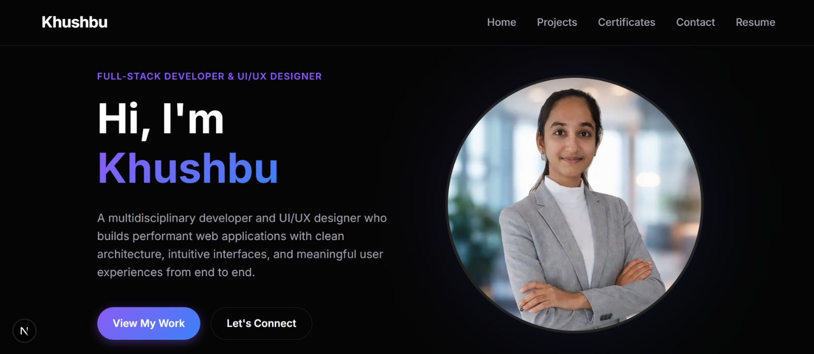

# 🚀 Khushbu Patel – Personal Portfolio

A modern, animated portfolio website built with Next.js to showcase my projects, technical skills, certifications, and contact information.

This portfolio reflects my approach to development — combining clean architecture, smooth user experience, and thoughtful design.

---

🔗 Live Website:
https://khushbu-patel-portfolio.netlify.app/

---

## ✨ Highlights

⚡ Built with Next.js for fast performance

📱 Fully responsive across devices

🛠️ Interactive project filtering system

📩 Functional contact form using EmailJS

🌙 Clean dark-themed modern UI

---

## 🛠️ Tech Stack

Frontend

- Next.js

- CSS3 (Custom Styling)

Services

- EmailJS (Contact Form)

- Netlify (Deployment & Hosting)

---

## 📸 Preview



---

## 🔧 Installation & Setup

If you'd like to run the project locally:

1️⃣ Clone the repository
```
git clone https://github.com/Khushbu696/Portfolio.git
```

2️⃣ Navigate into the project folder
```
cd Portfolio
```

3️⃣ Install dependencies
```
npm install
```

4️⃣ Start development server
```
npm run dev
```

The app will run at:

http://localhost:5173

---

## 📬 Contact

If you'd like to collaborate or connect:

GitHub: https://github.com/Khushbu696

LinkedIn: https://www.linkedin.com/in/khushbupatel06

---

© 2025 Khushbu Patel. All rights reserved.
